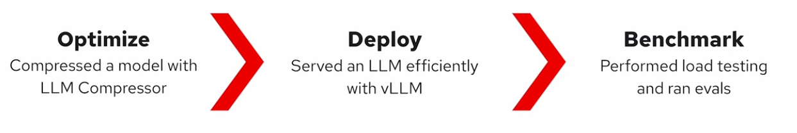
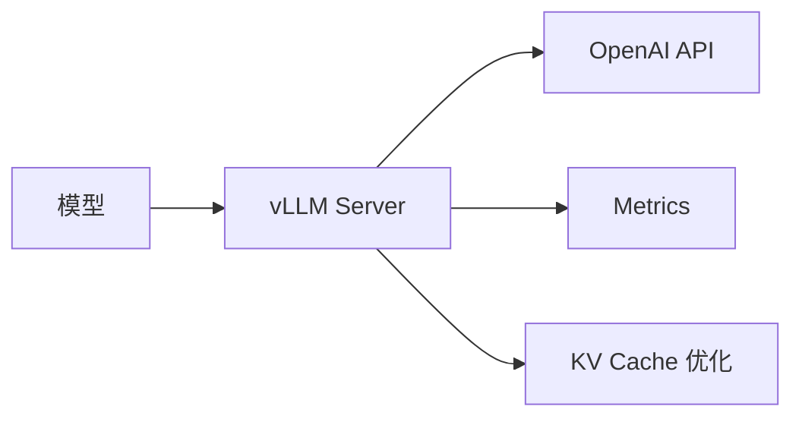
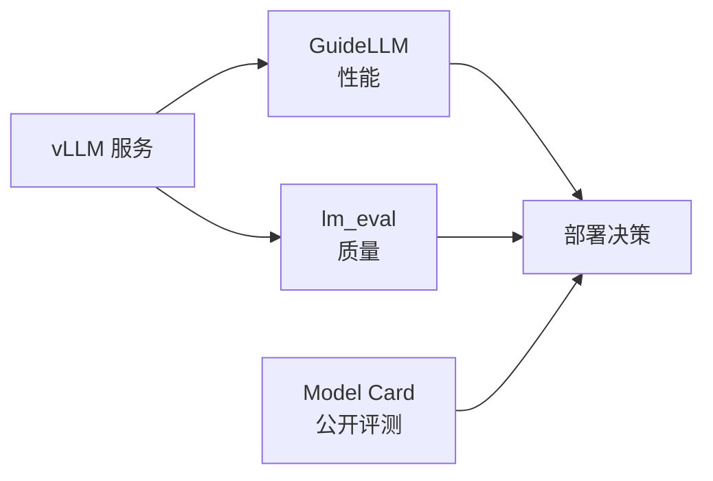
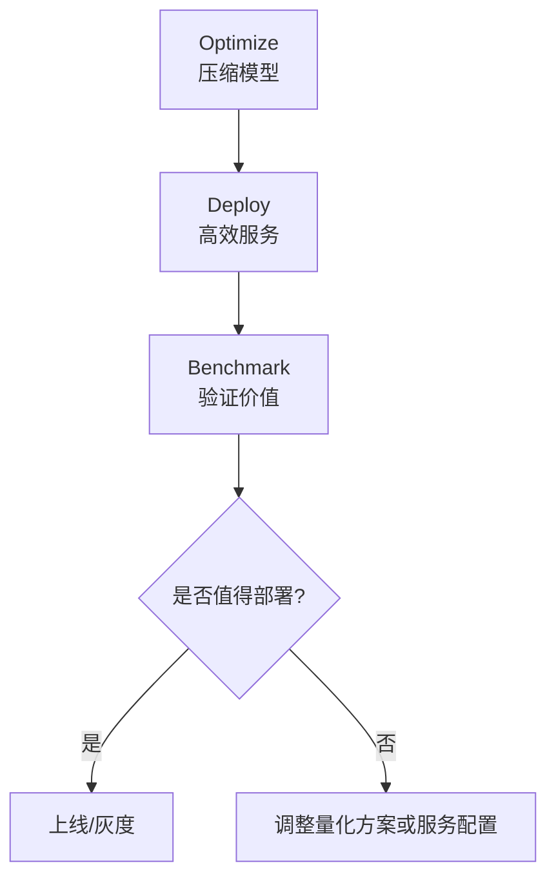

# Review：Optimize → Deploy → Benchmark

## 1. 总揽

本课程主线可以概括为一条 LLM 推理落地链路：

| 阶段 | 核心问题 | 工具 | 结果 |
|:--|:--|:--|:--|
| Optimize | 模型能不能更小？ | LLM Compressor | GPTQ W4A16 量化模型 |
| Deploy | 模型能不能高效服务？ | vLLM | OpenAI-compatible 推理服务 |
| Benchmark | 部署值不值得上线？ | GuideLLM + lm_eval | 性能与质量证据 |

一句话总结：

> 先用量化降低模型成本，再用 vLLM 提升服务效率，最后用 benchmark 判断性能收益和质量损失是否值得。

---

课程链接：https://www.deeplearning.ai/courses/fast-and-efficient-llm-inference-with-vllm

## 2. Optimize

目标：**压缩模型，降低部署成本。**

核心内容：

- 使用 `llm-compressor` 的 `oneshot` 做训练后量化。
- 使用 `GPTQModifier`，配置为 `W4A16`。
- 主要量化 `Linear` 层，保留 `lm_head` 高精度。
- 使用 WikiText-2 作为 calibration dataset。

关键结果：

| 指标 | 原始模型 | W4A16 量化模型 |
|:--|:--|:--|
| 模型大小 | 1.41 GB | 528.7 MB |
| Perplexity | 32.80 | 35.18 |
| 变化 | — | 大小减少约 64%，PPL 上升约 7.2% |

结论：

> W4A16 用可控质量损失换取显著模型压缩，是 LLM 部署中常见的实用折中。

---

## 3. Deploy

目标：**把模型变成可高效访问的推理服务。**

核心内容：

- 使用 `vllm serve` 启动模型服务。
- 通过 OpenAI-compatible API 调用本地模型。
- 使用 `/metrics` 观察服务状态。
- 理解 vLLM 的三类关键优化：
  - **Continuous batching**：token 级动态调度，提高吞吐。
  - **PagedAttention**：块化管理 KV cache，减少显存碎片。
  - **Prefix caching**：复用共享 prompt 的 KV cache，减少重复 prefill。

重点概念：

| 机制 | 解决的问题 |
|:--|:--|
| Continuous batching | 请求长度不一导致的 GPU 空等 |
| PagedAttention | KV cache 显存碎片和浪费 |
| Prefix caching | 多请求共享前缀的重复计算 |
| Thinking mode | 质量提升与 token/延迟成本权衡 |

结论：

> vLLM 的价值不只是“跑模型”，而是把模型变成面向并发请求的高效推理服务。

---

## 4. Benchmark

目标：**判断部署是否真的值得。**

核心内容：

- 用 **GuideLLM** 测部署性能。
- 用 **lm_eval** 测模型任务质量。
- 参考 model card 中的公开 benchmark 和 recovery。

关键指标：

| 工具 | 衡量内容 | 典型指标 |
|:--|:--|:--|
| GuideLLM | 服务性能 | TTFT、ITL、E2E latency、tokens/s |
| lm_eval | 模型质量 | Hellaswag accuracy 等 |
| Model card | 量化损失 | Recovery、各任务分数 |

评估重点：

- 不只看平均延迟，要看 **p95 / p99**。
- 不只看吞吐，也要看质量是否下降过多。
- 不同任务对量化敏感度不同，数学、代码、复杂推理通常更敏感。

部署判断：

> 好的量化部署不是单纯“更快”或“更小”，而是在延迟、吞吐、显存、成本和准确率之间取得可接受平衡。

---

## 最终总结

最终结论：

> LLM 推理优化不是单点技术，而是一条完整链路：
> **先压缩模型，再高效服务，最后用性能和质量指标验证是否值得部署。**
