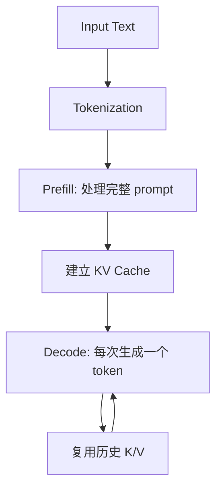
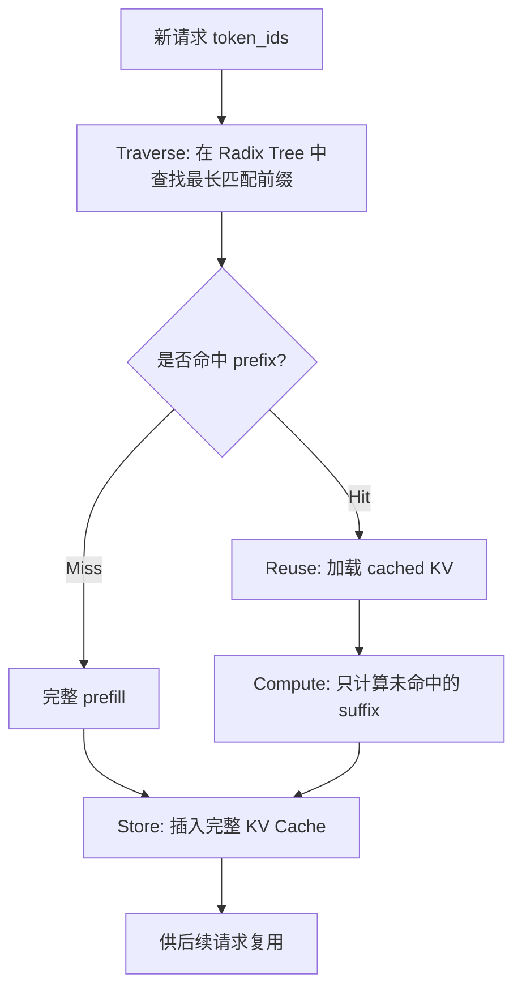
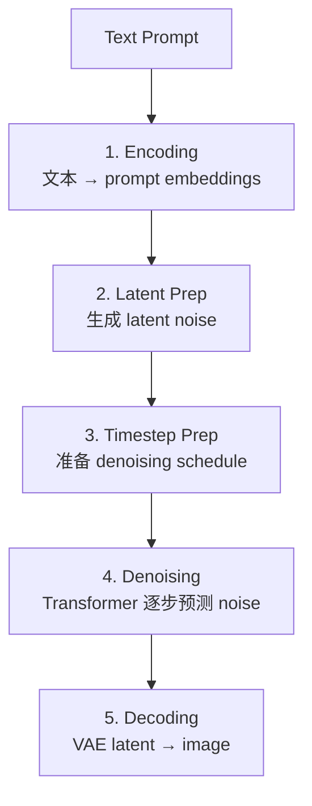
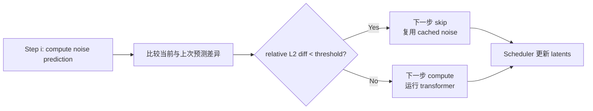
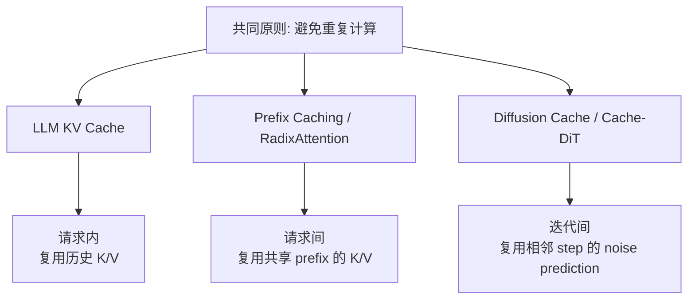

# SGLang Short Course Notes

## 1. 概览

本课程围绕 **高效推理** 展开：从 LLM 文本生成中的 KV Cache，到跨请求 Prefix Caching / RadixAttention，再到 Diffusion 图像生成中的 denoising cache。核心思想始终一致：

> **如果某段计算结果不会改变，就不要重复计算。**

<table>
  <tr>
    <td align="center" width="30%">
      <b>L2</b><br>
      LLM Inference Fundamentals<br>
      <sub>KV Cache inside one request</sub>
    </td>
    <td align="center">→</td>
    <td align="center" width="30%">
      <b>L3</b><br>
      Prefix Caching with RadixAttention<br>
      <sub>KV Cache across requests</sub>
    </td>
    <td align="center">→</td>
    <td align="center" width="30%">
      <b>L4</b><br>
      Diffusion Inference Fundamentals<br>
      <sub>Noise prediction cache across steps</sub>
    </td>
  </tr>
</table>

| Lesson | Focus | Cache Scope | Reused Computation |
|---|---|---|---|
| L2 | LLM token-by-token generation | Within one request | Historical K/V during decode |
| L3 | Prefix caching with radix tree | Across LLM requests | Shared prefix K/V during prefill |
| L4 | Diffusion denoising pipeline | Across denoising steps | Similar noise predictions |

官方课程链接：https://www.deeplearning.ai/courses/efficient-inference-with-sglang-text-and-image-generation

---

## 2. LLM Inference Fundamentals

LLM 生成文本是 **autoregressive generation**：每次生成一个 token，并把新 token 接到上下文后继续生成。

关键流程：



核心概念：

- **Tokenization**：文本会被切成模型实际处理的 token ids。
- **Attention**：核心公式是 `softmax(QKᵀ / √d_k) V`。
- **Causal Mask**：保证当前位置只能看见过去 token，不能看未来。
- **GQA**：多个 Query heads 共享更少的 K/V heads，降低 KV Cache 显存占用。
- **KV Cache**：K/V 对历史 token 不会改变，因此只需计算一次。

对比：

| 方式 | 行为 | 计算量趋势 |
|---|---|---|
| 无 KV Cache | 每一步重新处理完整历史序列 | 接近 O(n²) |
| 有 KV Cache | prefill 一次，decode 时只处理新 token | 接近 O(n) |

要点：**KV Cache 优化的是单个请求内部的 decode 重复计算。**

---

## 3. Prefix Caching with RadixAttention

L2 的 KV Cache 只存在于一次请求内；请求结束后缓存通常被丢弃。L3 进一步解决 **跨请求重复计算**。

典型场景：

```text
Request 1: Article + Question 1
Request 2: Article + Question 2
Request 3: Article + Question 3
```

这里 `Article` 是共享 **prefix**，每次问题是不同 **suffix**。Prefix Caching 会把共享前缀的 KV Cache 存起来，后续请求只计算 suffix。

RadixAttention 的核心流程：



关键组件：

| 组件 | 作用 |
|---|---|
| `CacheEntry` | 保存 token 序列与对应 KV Cache |
| `FlatRadixTree` | 查找最长共享前缀并插入新缓存项 |
| `generate_with_prefix_cache` | 命中时跳过 shared prefix，只计算 suffix |

核心公式：

```text
tokens_to_compute = total_tokens - cached_tokens
speedup ≈ total_tokens / tokens_to_compute
```

应用场景：

| 场景 | 缓存内容 | 典型收益 |
|---|---|---|
| RAG | 文档上下文 | 5–10× |
| Chatbot | System prompt / history | 3–5× |
| Few-shot | 示例 demonstrations | 4–8× |
| Code Generation | 仓库上下文 | 3–6× |

要点：**KV Cache 优化请求内；Prefix Caching 优化请求间；RadixAttention 用 radix tree 管理可复用前缀。**

---

## 4. Diffusion Inference Fundamentals

L4 从文本生成切换到图像生成，手动搭建一个 diffusion pipeline，并观察主要计算瓶颈。

Diffusion pipeline 五阶段：



核心内容：

- **Encoding**：将文本 prompt 编码成 embeddings，用于指导图像生成。
- **Latent Prep**：在 latent space 中生成初始噪声，显著降低空间计算量。
- **Timestep Prep**：生成 denoising 时间步，决定从强噪声到弱噪声的迭代路径。
- **Denoising**：最主要的计算瓶颈，通常占 80–90% compute。
- **Decoding**：用 VAE 将最终 latent 还原成 RGB 图像。

Diffusion cache 的动机：相邻 denoising steps 的 noise prediction 往往非常接近，尤其是后期 refinement 阶段。因此可以复用上一轮预测，跳过部分 transformer calls。



判断规则：

```text
relative_diff = ||current - previous|| / ||current||
```

要点：

- 早期 denoising steps 决定全局结构，变化大，通常不能跳过。
- 后期 denoising steps 主要做细节微调，变化小，更适合缓存。
- 阈值是质量与速度的 trade-off：太低几乎不跳过，太高可能损伤图像质量。
- SGLang-Diffusion 中的 **Cache-DiT** 是这一思想的生产级实现。

---

## 总结



三节课的主线可以概括为：

> **L2 解决单个 LLM 请求内部的重复计算；L3 解决多个 LLM 请求之间的重复计算；L4 将同样的缓存思想迁移到 diffusion denoising 过程。**
